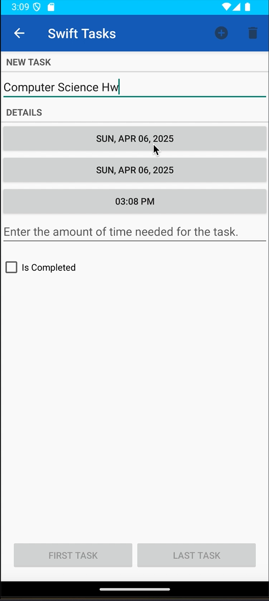
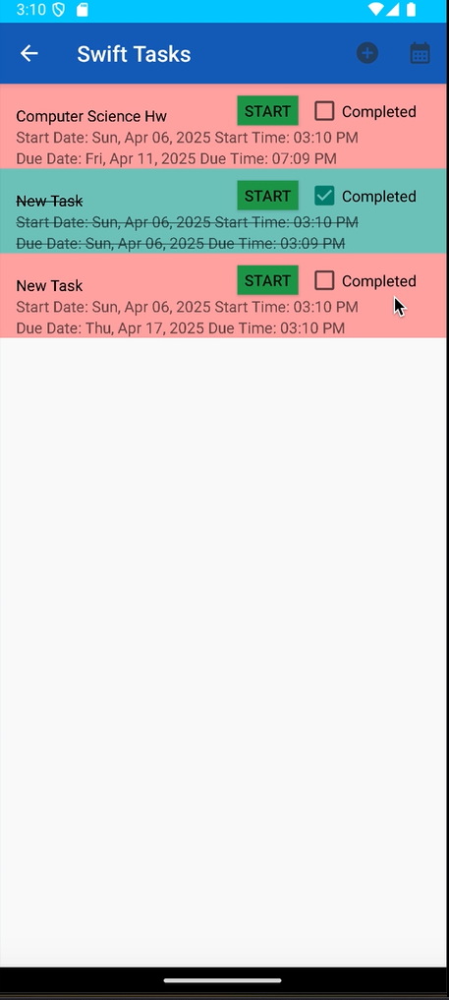
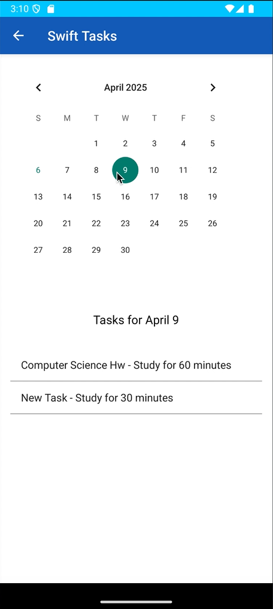

# Swift Tasks

Swift Tasks is a user-friendly scheduling app designed to help you stay on top of your tasks and deadlines. Create tasks with specific start and due dates, set due times, and track your progress. Swift Tasks also includes a built-in timer that allows you to pace yourself on tasks.

---

## Features

- **Task Creation**: Create tasks with start and due dates, and set specific due times.
- **User-Friendly Interface**: Clean and simple UI for efficient task creation.
- **Calendar**: View your tasks for any given day on the built-in calendar to easily manage your schedule.
- **Task Management**: Easily edit, update, and delete tasks as needed.
- **Due Time Notifications**: Set due times for your tasks and get notified when they are due.
- **Task Timer**: A built-in timer that starts when a task is due and plays an alarm once the timer runs out.
- **Save Your Progress**: All your data is saved, so you can access your tasks whenever you need them.

---

## Demo Video

  

    <iframe
      src="https://www.youtube.com/embed/D27bZh9T6iA"
      title="Swift Tasks Demo Video"
      frameborder="0"
      referrerpolicy="strict-origin-when-cross-origin"
      allow="accelerometer; autoplay; clipboard-write; encrypted-media; gyroscope; picture-in-picture"
      allowfullscreen
      style="position: absolute; top: 0; left: 0; width: 100%; height: 100%;">
    </iframe>
  

---

## Screenshots

  
  

  
  

---

## How It Works

1. **Create a Task**:  
   - Tap the "Add Task" button.
   - Enter a task name and description
   - Set a start date, due date, and time for the task.
   - Save the task.

2. **View Tasks on Calendar**:  
   - Go to the calendar view to see your tasks for any given day.

3. **Task Timer**:  
   - Once a task is due, a timer automatically starts.
   - When the timer runs out, an alarm is triggered to notify you that the task is due.

4. **Edit/Update Tasks**:  
   - Tap on a task to open and edit its details.
   - Update the task's information and save it.

5. **Complete/Delete Tasks**:  
   - Mark tasks as complete when finished, or delete tasks you no longer need.

---

