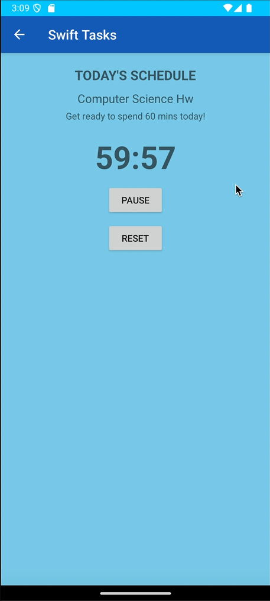

# 📝 Swift Tasks

Swift Tasks is an intuitive and user-friendly scheduling app designed to help you stay on top of your tasks and deadlines. Create tasks with specific start and due dates, set due times, and track your progress effortlessly. Swift Tasks also includes a built-in calendar that shows your tasks for any given day, making task management easier than ever.

The app is not out yet, but it will be available soon on the Google Play Store.

---

## 🚀 Features

- **Task Creation**: Quickly create tasks with start and due dates, and set specific due times.
- **User-Friendly Interface**: Swift Tasks features a clean and simple UI for fast and efficient task creation and management.
- **Built-in Calendar**: View your tasks for any given day on the built-in calendar to easily manage your schedule.
- **Task Management**: Easily edit, update, and delete tasks as needed.
- **Due Time Notifications**: Set precise due times for your tasks and get notified when they are due.
- **Task Timer**: A built-in timer that starts when a task is due and plays an alarm once the timer runs out.
- **Save Your Progress**: All your data is saved so you can access your tasks whenever you need them.

---

## 📸 Screenshots

  
  

  
  

---

## 📺 Demo Video

Watch the demo video to get a sense of how Swift Tasks works and its key features:

---

## ⏰ How It Works

1. **Create a Task**:  
   - Tap the "Add Task" button.
   - Enter a task name and description (optional).
   - Set a start date, due date, and time for the task.
   - Save the task.

2. **View Tasks on Calendar**:  
   - Go to the calendar view to see your tasks for any given day.

3. **Task Timer**:  
   - Once a task is due, a timer automatically starts.
   - When the timer runs out, an alarm is triggered to notify you that the task is due.

4. **Edit/Update Tasks**:  
   - Tap on a task to open and edit its details.
   - Update the task's information and save it.

5. **Complete/Delete Tasks**:  
   - Mark tasks as complete when finished, or delete tasks you no longer need.

---

## 📅 Potentially coming Soon to the Google Play Store

Swift Tasks will be potentially available soon on the Google Play Store. Stay tuned for updates, and get ready to enhance your productivity with an easy-to-use task manager!

